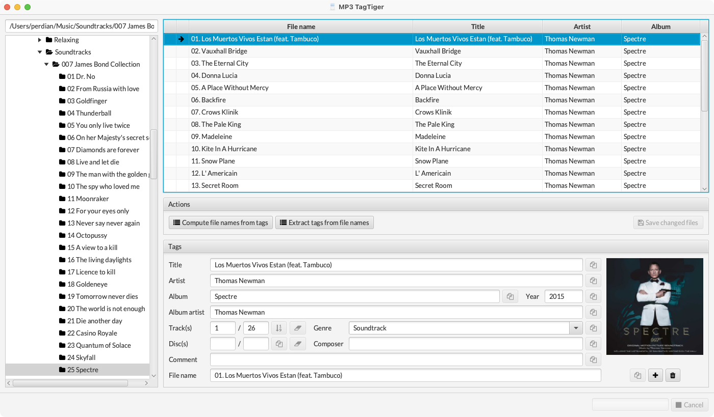
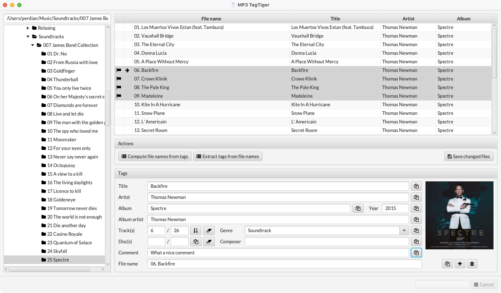

# MP3 TagTiger

The MP3 TagTiger aims to be one of the best applications to use for editing metadata on MP3 files. Although many other applications are offering a similar functionality, I found their use to be rather cumbersome. It took me too long to reach the result I wanted (for example quickly changing the genre of all files within a directory) and as being a developer I started to implement my own solution.

I do not claim that that the user experience choices made are working for everyone but they definitely work for me - and that's my main objective. If anyone else agrees then perfect!

The application itself is completely free of any spy- or adware and doesn't send any data to any system. It works completely offline.

## User interface

The user interface is centered around files in a directory (or sub-directories):

Within the detailed editor screen on the right side a copy button is available for every textfield. This copy button will copy the currently selected text value to all other files that have been selected in the left file list.

In the example above four files have been selected. The currently active file is "10 Welcome to Apollo 13" which is indicated by the magnifier icon in the table (1). If you now click on the copy icon (2) the text "What a nice comment" will be copied into all the "comment" fields for the four selected files. After that all these four files are marked as dirty, meaning they have been changed and the changes need to be saved in order to become permanent. Dirty files are always recognizable by the red flag on the left of the file name.

## Building the application

### Generic build

The application is written in pure Java, using a JavaFX frontend. It's therefore platform independent and can be built and run on every platform supporting a Java SDK.

For building it simply checkout the repository from GitHub and call the Maven package target on the command line:

    $ git clone https://github.com/perdian/mp3tagtiger.git
    $ cd mp3tagtiger
    $ mvn clean package
    $ java -jar target/tagtiger.jar

### macOS build

On macOS a simplified build that directly generated a DMG archive from which the application can be installed or distributed can be built using the following commands:

    $ git clone https://github.com/perdian/mp3tagtiger.git
    $ cd mp3tagtiger
    $ mvn clean package -Pmacos-bundle
    $ open target/MP3\ TagTiger.dmg
